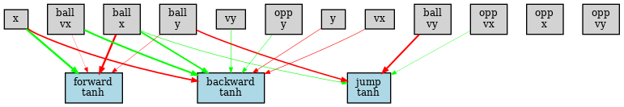
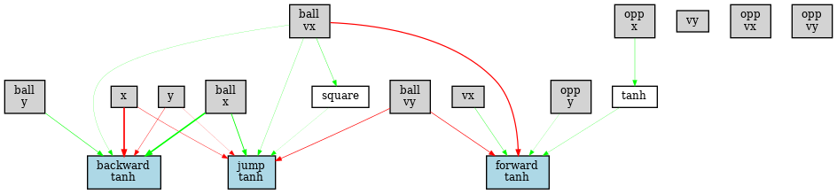

# Slime Volleyball AI

In this project, I trained an agent to play Slime Volleyball using the [NEAT](https://en.wikipedia.org/wiki/Neuroevolution_of_augmenting_topologies) algorithm (NeuroEvolution of Augmenting Topologies).

Left: Baseline - Right: NEAT agent #1  

Neural net of NEAT agent #1  

Left: Baseline - Right: NEAT agent #2  

Neural net of NEAT agent #2  

## Method

[NEAT](https://en.wikipedia.org/wiki/Neuroevolution_of_augmenting_topologies) is an evolutionary algorithm that evolves a neural network starting from a simple one, progressively adding or removing nodes and connections, and changing the weights to maximize the fitness function. In this case, the fitness function is the score obtained against a baseline after 3000 time steps of gameplay.

## Results

After roughly 1000 generations, NEAT tends to evolve a simple neural network with few nodes, avoiding overfitting. The neural network often ignores the opponent's information, making the resulting agent robust against different kinds of opponents.

The best agent I could evolve achieves an average score of 0.77 ± 0.92 against the baseline (1024 trials and 3000 time steps per trial).

## Code

[JAX](https://jax.readthedocs.io/en/latest/installation.html) with GPU support is required to execute the code.

The Slime Volleyball environment has been adapted from [EvoJAX](https://github.com/google/evojax), and the NEAT implementation has been modified from [neat-python](https://github.com/CodeReclaimers/neat-python).

The only modification made to neat-python is the definition of the neural network's feedforward function. This change ensures JIT compilation compatibility with JAX and allows processing a batch of neural networks in parallel, significantly accelerating inference with a GPU.